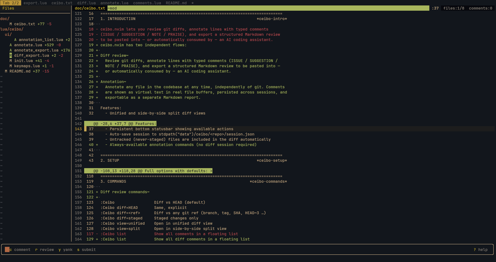
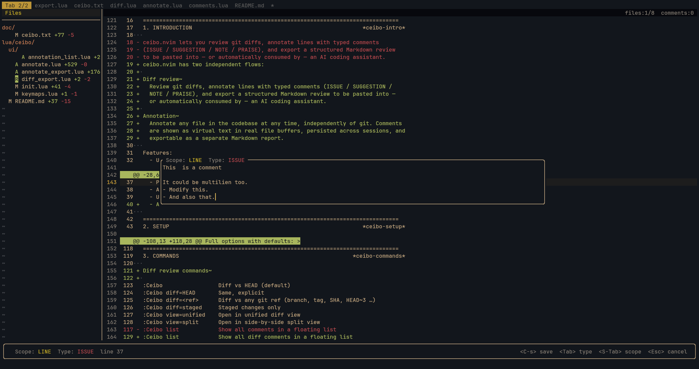
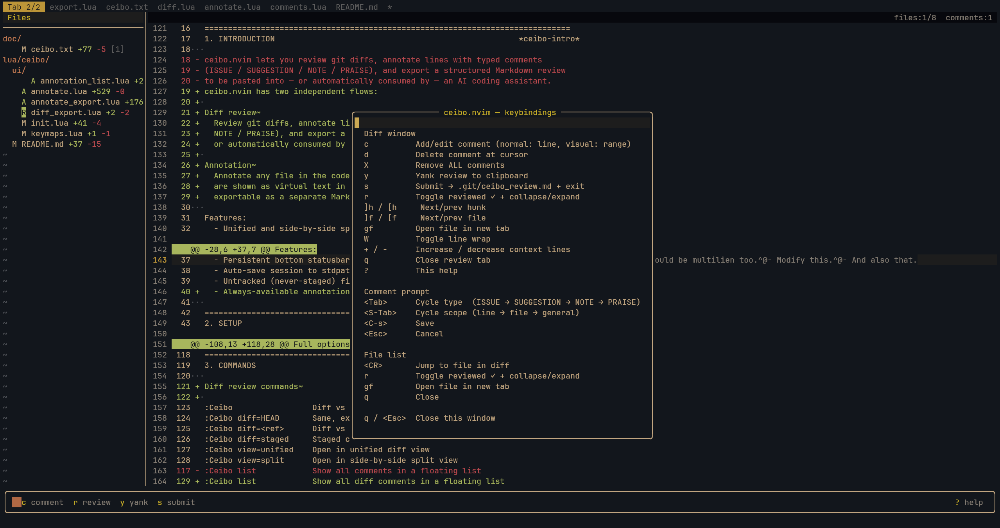

# Ceibo

A Neovim plugin for reviewing git diffs and annotating codebases — generates structured Markdown reports to feed back into AI coding assistants (Claude Code, OpenCode, etc.).

## What it does

Two independent flows:

**Diff review** — open a navigable git diff, annotate lines with typed comments, export a structured review to paste into your AI assistant.

**Codebase annotation** — comment on any file at any time (no diff needed), browse and delete annotations from a floating list, export a separate report.

## Diff review workflow

```
╔══════════════════╗         ╔══════════════════════════════╗
║  AI assistant    ║         ║     Neovim (ceibo.nvim)      ║
╠══════════════════╣         ╠══════════════════════════════╣
║  1. makes changes║         ║  2. you run :Ceibo           ║
║                  ║         ║  ┌──────────┬──────────────┐ ║
║                  ║         ║  │ files    │  diff view   │ ║
║                  ║         ║  │ ✓ foo.lua│  42 + code   │ ║
║                  ║         ║  │   bar.lua│     ▶ [ISSUE]│ ║
║                  ║         ║  └──────────┴──────────────┘ ║
║                  ║         ║  3. annotate, comment        ║
║  5. paste review ║◀──────y─║  4. press y to yank review  ║
║     fix issues   ║         ║     to clipboard             ║
╚══════════════════╝         ╚══════════════════════════════╝
```

1. Run your AI assistant and let it make changes
2. Run `:Ceibo` — navigate the diff, add comments, mark files reviewed
3. Press `y` to yank the review Markdown to clipboard
4. Paste into the AI assistant and ask it to address all ISSUE and SUGGESTION comments

## Annotation workflow

Annotate any file in your codebase at any point during development:

```
:Ceibo annotate comment   add / edit annotation at cursor (or visual range)
:Ceibo annotate delete    delete annotation at cursor (line-scoped)
:Ceibo annotate list      browse all annotations — <CR> jumps, d deletes
:Ceibo annotate report    export annotations.md + yank to clipboard
```

Annotations appear as virtual text in real file buffers and persist across sessions.

## Requirements

- Neovim 0.10+
- Git

## Installation

**lazy.nvim**:

```lua
return {
  "rufex/ceibo.nvim",
}
```

**vim-pack**:

```lua
vim.pack.add({"https://github.com/rufex/ceibo.nvim"})
require("ceibo").setup({})
```

## Usage

**Diff review:**
```
:Ceibo                 diff vs HEAD (default)
:Ceibo diff=HEAD       same, explicit
:Ceibo diff=main       diff vs any git ref (branch, tag, SHA, HEAD~3 …)
:Ceibo diff=staged     staged changes only
:Ceibo view=unified    switch to unified diff view
:Ceibo view=split      switch to side-by-side split view
:Ceibo list            show all comments in a floating list
```

**Annotations:**
```
:Ceibo annotate comment   add / edit annotation at cursor (or visual range)
:Ceibo annotate delete    delete annotation at cursor (line-scoped)
:Ceibo annotate list      browse all annotations — <CR> jumps, d deletes
:Ceibo annotate report    export annotations.md + yank to clipboard
```

## Configuration

```lua
require("ceibo").setup({
  -- set false to define all keymaps yourself (see Custom keymaps below)
  set_default_keymaps = true,

  -- default diff view: "unified" | "split"
  view_mode = "unified",

  -- git ref to diff against by default (nil = HEAD)
  base_ref = nil,

  -- comment types shown in the prompt and included in the export header
  -- each entry requires `name` and `description`; `hl` is optional (defaults to "CeiboComment<Name>")
  types = {
    { name = "ISSUE",      description = "bug or problem — fix it"                     },
    { name = "SUGGESTION", description = "improvement to discuss — ask before changing" },
    { name = "NOTE",       description = "informational — no action needed"             },
    { name = "PRAISE",     description = "positive feedback — no action needed"         },
  },

  layout = {
    file_list_width = 30,
  },

  -- define you own keymaps
  keymaps = {
    add_comment    = "c",
    delete_comment = "d",
    yank           = "y",
    submit         = "s",
    next_hunk      = "]h",
    prev_hunk      = "[h",
    next_file      = "]f",
    prev_file      = "[f",
    mark_reviewed  = "r",
    close          = "q",
  },

  -- highlight groups for diff and comments (linked to existing groups by default)
  highlights = {
    CeiboAdd               = { link = "DiffAdd"         },
    CeiboDel               = { link = "DiffDelete"      },
    CeiboHdr               = { link = "DiffText"        },
    CeiboFileHeader        = { link = "Title"            },
    CeiboCommentIssue      = { link = "DiagnosticError" },
    CeiboCommentSuggestion = { link = "DiagnosticWarn"  },
    CeiboCommentNote       = { link = "DiagnosticInfo"  },
    CeiboCommentPraise     = { link = "DiagnosticOk"    },
    CeiboCommentText       = { link = "Comment"         },
    CeiboReviewed          = { link = "DiagnosticOk"    },
    CeiboRangeHL           = { link = "Visual"          },
    CeiboCollapsed         = { link = "Comment"         },
    CeiboDir               = { link = "Directory"       },
  },
})
```

## Session persistence

Diff review comments and reviewed flags are auto-saved to `stdpath("data")/ceibo/<repo>/session.json` after every change and restored automatically on next `:Ceibo`. The session file is cleared on submit.

Annotations are auto-saved to `annotations.json` in the same directory and rendered as virtual text on every `BufEnter` for files that have annotations.

## Acknowledgments

ceibo.nvim is heavily inspired by [tuicr](https://github.com/agavra/tuicr) by [@agavra](https://github.com/agavra) — a terminal UI for the same AI-assisted code review workflow. Most features and behaviour here replicate what tuicr implemented in the first place. If you are not tied to Neovim, try tuicr first: it is more polished and has more features.

## Screenshots






